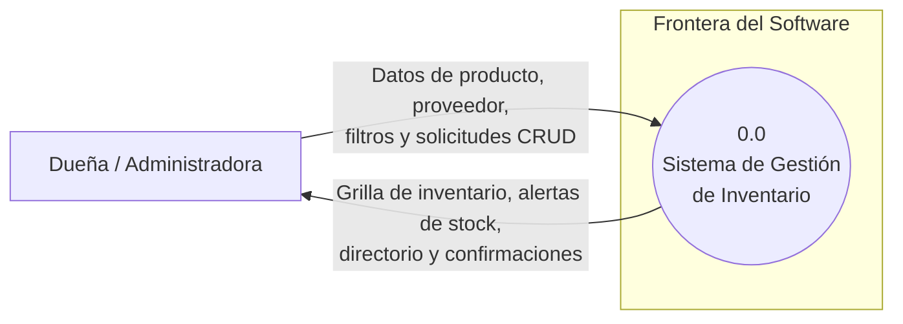
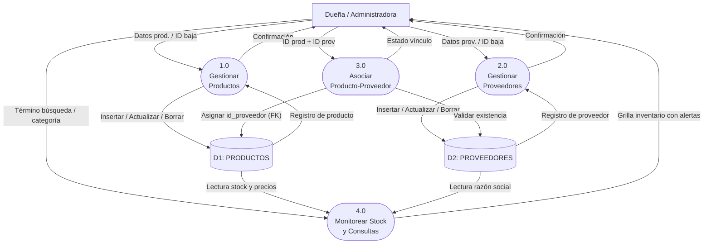
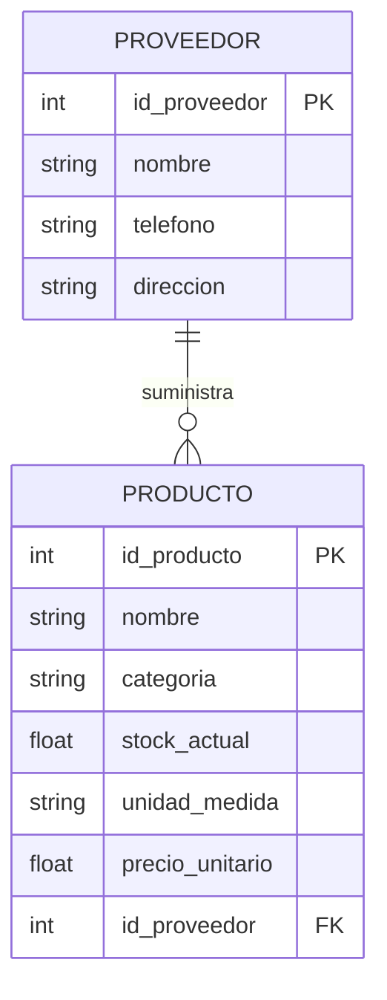
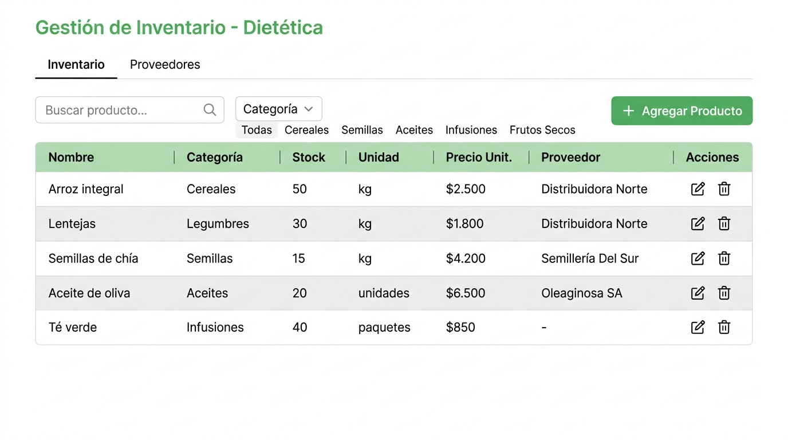
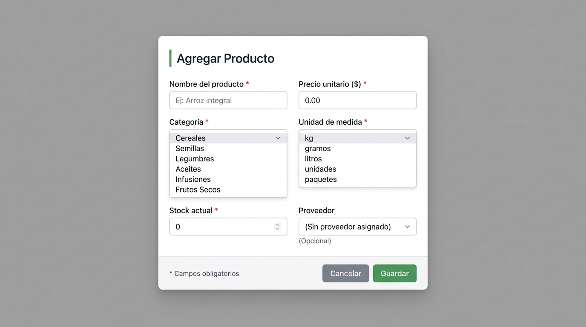
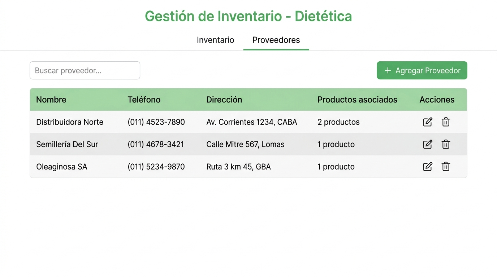
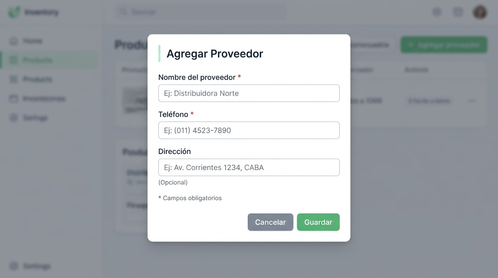

# ESPECIFICACIÓN DE REQUERIMIENTOS DE SOFTWARE (SRS)

**Sistema:** Gestión de Inventario para Dietética de Barrio  
**Institución:** Escuela Da Vinci — Primera Escuela de Arte Multimedial  
**Carrera:** Analista de Sistemas / Diseño y Programación Web  
**Materia:** Análisis y Metodología de Sistemas (Ciclo Lectivo 2026)  
**Cátedra:** Prof. Diego Simonelli  
**Integrantes:** Ricardo Gabriel Diaz · Nicolás Gerardo Benitez  
**Instancia de Evaluación:** Primer Parcial — Integración de Modelado Estructurado  
**Versión:** 1.0 (Septiembre 2026) — Formato bajo lineamientos IEEE 830  

---

# PARTE A — PROPUESTA LABORAL Y ANÁLISIS DE NEGOCIO

### A.1 Scoping y Declaración de Propósitos

**Propósito del Sistema:**  
Proveer una aplicación web de gestión de inventario liviana, intuitiva y centralizada para una dietética minorista de barrio, optimizando el control de existencias pesables/fraccionadas y la consulta de proveedores comerciales, reduciendo las horas administrativas de recuento físico y previniendo quiebres de stock.

**Procesos Incluidos (In Scope):**
* **Gestión de Mercadería:** Altas, modificaciones, bajas y listado general de productos categorizados.
* **Gestión de Proveedores:** Registro, actualización, eliminación y consulta de distribuidores mayoristas.
* **Asociación Relacional:** Asignación directa de cada producto a su proveedor habitual ($1:N$, opcional en el alta).
* **Búsqueda y Filtros:** Filtrado en tiempo real por coincidencia de nombre y clasificación taxonómica.
* **Monitoreo de Existencias:** Indicadores visuales de stock bajo (umbral $\le 5$ unidades/kg) y agotado ($= 0$).

**Procesos Excluidos (Out of Scope) y Justificación:**

| Proceso Excluido | Justificación Técnica y Operativa |
|---|---|
| Facturación fiscal (AFIP/ARCA) | Excede el alcance de control de stock interno; no requerido en esta fase. |
| Punto de venta (POS) y caja diaria | La prioridad del comercio es ordenar depósitos y góndolas antes de automatizar caja. |
| Gestión de cuentas corrientes | Las compras y ventas del local se efectúan al contado/contra entrega. |
| Autenticación multi-rol | Sistema monousuario operado exclusivamente por la dueña en la terminal del local. |

**Categorías de Mercadería Soportada:**  
Cereales (arroz, avena), Legumbres (lentejas, garbanzos), Semillas (chía, sésamo), Aceites (oliva, coco), Infusiones (té verde, manzanilla) y Frutos Secos (nueces, almendras).

---

### A.2 Benchmarking de Soluciones Similares

| Criterio Comparativo | Excel / Google Sheets | Tango Gestión (ERP) | Treinta / Kyte App | Sistema Propuesto |
|---|---|---|---|---|
| Enfoque en dietéticas | Nulo (planilla genérica) | Nulo (corporativo) | Genérico (kiosco/ropa) | **Específico (categorías y unidades ad-hoc)** |
| Validación de datos | Nula (propensa a celdas corruptas) | Alta (motor relacional estricto) | Media (orientado a venta rápida) | **Alta (validación obligatoria en backend y frontend)** |
| Vínculo producto-proveedor | Manual por texto | Módulo complejo sobredimensionado | Limitado / de pago | **Directo, relacional y configurable (1 a N)** |
| Curva de aprendizaje | Media | Muy alta (requiere semanas de curso) | Baja | **Mínima (interfaz limpia orientada a no técnicos)** |
| Manejo fraccionado (kg, gr) | Requiere fórmulas manuales | Configuración compleja de artículos | Inflexible para decimales | **Nativo (soporta decimales y selectores de unidad)** |
| Costo de adopción | "Gratis" (demanda horas manuales) | Licencia corporativa muy onerosa | Suscripción mensual recurrente | **Costo único accesible de implementación local** |

**Conclusión:**  
Excel carece de integridad relacional; Tango ERP introduce módulos innecesarios (sueldos, asientos contables) inmanejables para una microempresa; las aplicaciones móviles no ofrecen la ergonomía necesaria para carga de escritorio con balanza comercial. Nuestro sistema cubre con precisión este nicho operativo.

---

### A.3 Rentabilidad y Retorno de la Inversión (ROI)

* **Modelo de Comercialización:** Licencia de uso e instalación local (pago único) + abono opcional de soporte preventivo y backup semestral.
* **Ahorro Operativo:** Se calcula una reducción de $3.5\text{ horas semanales}$ dedicadas a recuentos manuales y cuadernos desordenados ($\approx 14\text{ horas mensuales}$ recuperadas para atención comercial).
* **Prevención de Pérdidas:** El control de stock crítico evita el desabastecimiento de artículos de alta rotación y alto margen (almendras, nueces), estimando un recupero de ventas perdidas de $\$45.000$ mensuales.
* **Plazo de Amortización:** La inversión inicial se recupera operativamente dentro de los primeros 45 días de uso continuo.

---

# PARTE B — MODELADO AMBIENTAL Y FUNCIONAL

### B.1 Diagrama de Contexto (DFD Nivel 0)

La Dueña / Administradora es el **único terminador interactivo directo** de la aplicación. Los proveedores son entidades informativas registradas por la dueña, no usuarios de la consola web.

**Terminador Externo:**

| Terminador | Rol | Intercambio de Información |
|---|---|---|
| Dueña / Administradora | Operadora monousuario | **Entrada:** `Datos_Producto_Entrada`, `Datos_Proveedor_Entrada`, `Criterio_Busqueda`, `Comandos_CRUD` **Salida:** `Grilla_Inventario`, `Directorio_Proveedores`, `Alerta_Stock`, `Mensaje_Respuesta` |

---

### B.2 Lista de Acontecimientos Clasificada

* **Flujo (F):** Ingreso externo de datos que genera almacenamiento o modificación de registros.
* **Temporal (T):** Disparado por reloj de sistema o control periódico de umbrales internos.
* **Control (C):** Señal, solicitud de baja o comando de consulta que no introduce activos masivos de datos.

| # | Tipo | Acontecimiento Externo | Respuesta Obligatoria del Software |
|---|---|---|---|
| 1 | **(F)** | La dueña registra un nuevo producto | Valida campos requeridos/unicidad y persiste en `D1_PRODUCTOS`. |
| 2 | **(F)** | La dueña actualiza datos de un producto | Sobrescribe los atributos modificados en `D1_PRODUCTOS`. |
| 3 | **(F)** | La dueña registra un nuevo proveedor | Valida datos de contacto y persiste en `D2_PROVEEDORES`. |
| 4 | **(F)** | La dueña actualiza datos de un proveedor | Sobrescribe los datos de contacto en `D2_PROVEEDORES`. |
| 5 | **(C)** | La dueña solicita eliminar un producto | Pide confirmación y elimina físicamente el registro en `D1_PRODUCTOS`. |
| 6 | **(C)** | La dueña solicita eliminar un proveedor | Verifica que no posea productos asociados y ejecuta la baja en `D2`. |
| 7 | **(C)** | La dueña consulta el inventario general | Recupera registros de `D1` y renderiza la grilla principal. |
| 8 | **(C)** | La dueña filtra por nombre o categoría | Ejecuta consulta con filtros y refresca la vista de productos. |
| 9 | **(C)** | La dueña asocia producto a proveedor | Actualiza la clave foránea `id_proveedor` en `D1_PRODUCTOS`. |
| 10 | **(T)** | Verificación horaria de existencias | Evalúa si `stock_actual <= 5` y activa indicador de reposición preventiva. |

---

### B.3 Diagrama de Flujo de Datos (DFD Nivel 1)

**Especificación Sintética de Procesos:**
* **1.0 Gestionar Productos:** CRUD sobre `D1: PRODUCTOS`. Valida no negatividad y formato numérico.
* **2.0 Gestionar Proveedores:** CRUD sobre `D2: PROVEEDORES`. Controla que no se eliminen distribuidores con artículos activos.
* **3.0 Asociar Producto-Proveedor:** Enlaza registros persistiendo la clave foránea `id_proveedor` en `D1`.
* **4.0 Monitorear Stock y Consultas:** Cruza datos de `D1` y `D2`, evalúa umbrales ($\le 5$) y entrega la grilla filtrada a la interfaz.

---

### B.4 Especificación Formal de Caso de Uso

**CU-01 — Registrar Nuevo Producto**
* **Actor Principal:** Dueña / Administradora.
* **Precondición:** Aplicación iniciada y pantalla de Inventario visible.
* **Flujo Principal:**
  1. La dueña presiona el botón `+ Agregar Producto`.
  2. El sistema despliega el formulario modal de alta y carga en el selector "Proveedor" los registros activos de `D2`.
  3. La dueña completa: Nombre, Categoría (dropdown), Stock actual ($\ge 0$), Unidad de medida (dropdown), Precio unitario ($> 0$) y Proveedor (opcional).
  4. La dueña presiona `Guardar`.
  5. El sistema valida: campos obligatorios no vacíos, stock y precio numéricos no negativos y unicidad de nombre en la categoría.
  6. El sistema genera un nuevo identificador `@id_producto` autoincremental y persiste el registro en `D1: PRODUCTOS`.
  7. El modal se cierra, la grilla se actualiza y se emite la notificación: *"Producto registrado con éxito"*.
* **Flujos Alternativos:**
  * **FA-1 (Campo obligatorio faltante o numérico inválido):** El sistema remarca el campo en rojo, emite mensaje descriptivo del error y conserva los datos en el modal. Retorna al paso 3.
  * **FA-2 (Nombre duplicado en igual categoría):** El sistema alerta la colisión y consulta si desea editar el existente en vez de crear uno nuevo.
  * **FA-3 (Sin proveedores registrados):** El selector muestra `(Sin proveedor asignado)`. La dueña puede guardar el producto sin proveedor y asociarlo posteriormente.
* **Postcondición:** Registro persistido en `D1` y visible inmediatamente en el inventario.

---

# PARTE C — MODELADO DE DATOS Y ESTRUCTURA

### C.1 Diagrama Entidad-Relación (DER Lógico)

* **Semántica:** Cardinalidad $1:N$. Un proveedor abastece de $0$ a $N$ productos. Un producto es suministrado por $0$ o $1$ proveedor formal (clave foránea `id_proveedor` admite nulos).

---

### C.2 Diccionario de Datos Estructurado

**Notación Oficial de Cátedra (Yourdon / DeMarco):**  
`=` (está compuesto de) | `+` (concatenación) | `( )` (opcional) | `{ }` (repetición) | `[ ]` (selección disyuntiva) | `@` (clave primaria/única) | `* *` (comentario).

#### 1. Almacenes de Persistencia
* `D1_PRODUCTOS = { Registro_Producto }`
* `D2_PROVEEDORES = { Registro_Proveedor }`

#### 2. Registros y Entidades
* `Registro_Producto = @id_producto + nombre + categoria + stock_actual + unidad_medida + precio_unitario + (id_proveedor)`
* `Registro_Proveedor = @id_proveedor + nombre + telefono + (direccion)`

#### 3. Flujos de Datos
* `Datos_Producto_Entrada = nombre + categoria + stock_actual + unidad_medida + precio_unitario + (id_proveedor)`
* `Datos_Proveedor_Entrada = nombre + telefono + (direccion)`
* `Criterio_Busqueda = (termino_busqueda) + (categoria_filtro)`
* `Alerta_Stock = @id_producto + nombre + stock_actual + unidad_medida + estado_alerta`

#### 4. Dominio de Campos Primitivos

| Campo Primitivo | Tipo Físico | Dominio y Valores Válidos | Restricción / Significado |
|---|---|---|---|
| `@id_producto` | Entero | $> 0$ autoincremental | Clave primaria (PK) única de producto. |
| `nombre` | Texto(100) | Cadena alfanumérica no vacía | Denominación comercial del producto. |
| `categoria` | Texto | `[Cereales | Legumbres | Semillas | Aceites | Infusiones | Frutos Secos]` | Clasificación taxonómica de la tienda. |
| `stock_actual` | Decimal | $\ge 0.00$ (hasta 2 decimales) | Existencia física disponible. Admite fracciones. |
| `unidad_medida` | Texto | `[kg | gramos | litros | unidades | paquetes]` | Escala física de comercialización. |
| `precio_unitario` | Decimal | $> 0.00$ en pesos argentinos (ARS) | Precio de venta final por unidad de medida. |
| `id_proveedor` (FK) | Entero | ID existente en `D2` o `NULL` | Clave foránea referencial al proveedor asignado. |
| `@id_proveedor` | Entero | $> 0$ autoincremental | Clave primaria (PK) única de proveedor. |
| `telefono` | Texto(25) | Cadena numérica y símbolos `()-+` | Teléfono directo o WhatsApp del distribuidor. |
| `direccion` | Texto(200) | Texto libre (opcional) | Domicilio del depósito o local mayorista. |
| `estado_alerta` | Texto | `[NORMAL | STOCK_BAJO | AGOTADO]` | Flag dinámico: `AGOTADO` ($stock = 0$), `STOCK_BAJO` ($stock \le 5$). |

---

# PARTE D — DISEÑO VISUAL Y PROTOTIPADO

### D.1 Lineamientos UI/UX
* **Consistencia Operativa:** Barra superior fija con dos pestañas (*Inventario* y *Proveedores*).
* **Acciones Uniformes:** Ícono de lápiz para edición con precarga y papelera para borrado con confirmación.
* **Formularios Modales:** Carga rápida centrada sobre telón oscuro para evitar desvíos de foco.

---

### D.2 Mockups de Pantallas

#### Pantalla 1 — Inventario (Listado General, Filtros y Alertas)
* **Archivo gráfico:** `mockups/mockup_inventario.jpg`  
* **Casos de uso cubiertos:** CU-03 (Eliminar), CU-04 (Consultar), CU-05 (Buscar y Filtrar), CU-06 (Alertas).

* **Componentes:** Input reactivo de búsqueda por texto, dropdown/píldoras de filtrado por categoría, botón principal `+ Agregar Producto` y grilla con visualización de proveedor vinculado y stock.

---

#### Pantalla 2 — Modal Formulario de Producto (Alta y Edición)
* **Archivo gráfico:** `mockups/mockup_formulario_producto.jpg`  
* **Casos de uso cubiertos:** CU-01 (Registrar Producto), CU-02 (Modificar Producto), CU-10 (Vincular Proveedor).

* **Componentes:** Inputs con validación de tipo numérico para precio y stock, selectores cerrados para categorías y unidades de medida estandarizadas, y selector de proveedor precargado desde `D2`.

---

#### Pantalla 3 — Directorio de Proveedores
* **Archivo gráfico:** `mockups/mockup_proveedores.jpg`  
* **Casos de uso cubiertos:** CU-07 (Registrar), CU-08 (Modificar), CU-09 (Eliminar Proveedor), Consulta general.

* **Componentes:** Grilla con datos de contacto rápido y columna de control de integridad referencial (*"Productos asociados"* calculados dinámicamente).

---

#### Pantalla 4 — Modal Formulario de Proveedor (Alta y Edición)
* **Archivo gráfico:** `mockups/mockup_formulario_proveedor.jpg`  
* **Casos de uso cubiertos:** CU-07 (Registrar Proveedor), CU-08 (Modificar Proveedor).

* **Componentes:** Campos directos para razón social y teléfono mandatorios, con dirección física optativa.

---

# PARTE E — BALANCEO DE MODELOS Y MATRIZ DE TRAZABILIDAD

### E.1 Matriz de Balanceo Estricto: DFD vs. DER vs. Diccionario de Datos

| Almacén (DFD N1) | Entidad (DER) | Registro (Diccionario) | Verificación de Atributos y Coherencia |
|---|---|---|---|
| `D1: PRODUCTOS` | `PRODUCTO` | `D1_PRODUCTOS = { Registro_Producto }` | **Balanceado:** Coinciden `@id_producto` (PK), `nombre`, `categoria`, `stock_actual`, `unidad_medida`, `precio_unitario` y `id_proveedor` (FK). |
| `D2: PROVEEDORES` | `PROVEEDOR` | `D2_PROVEEDORES = { Registro_Proveedor }` | **Balanceado:** Coinciden `@id_proveedor` (PK), `nombre`, `telefono` y `direccion`. |

* **Regla de Balances:** Ningún almacén del DFD carece de entidad en el DER; ningún flujo de escritura/lectura contiene campos ausentes en el Diccionario de Datos.

---

### E.2 Matriz de Trazabilidad Integral de Requerimientos

| ID Req. | Acontecimiento Disparador | Tipo | Proceso DFD N1 | Almacén / Entidad | Caso de Uso | Pantalla Asociada |
|---|---|---|---|---|---|---|
| **RF-01** | #1: Dueña ingresa nuevo producto | (F) | **1.0** Gestionar Prod. | D1 / `PRODUCTO` | CU-01 Alta Producto | Pantalla 2 (Modal Producto) |
| **RF-02** | #2: Dueña edita un producto | (F) | **1.0** Gestionar Prod. | D1 / `PRODUCTO` | CU-02 Modif. Producto | Pantalla 2 (Modal Producto) |
| **RF-03** | #5: Dueña elimina un producto | (C) | **1.0** Gestionar Prod. | D1 / `PRODUCTO` | CU-03 Baja Producto | Pantalla 1 (Ícono papelera) |
| **RF-04** | #7: Dueña visualiza inventario | (C) | **4.0** Monitorear Stock | D1 + D2 | CU-04 Consultar Stock | Pantalla 1 (Grilla inventario) |
| **RF-05** | #8: Dueña filtra por nombre/cat. | (C) | **4.0** Monitorear Stock | D1 / `PRODUCTO` | CU-05 Filtrar Catálogo | Pantalla 1 (Buscador y dropdown) |
| **RF-06** | #10: Control horario de stock | (T) | **4.0** Monitorear Stock | D1 / `PRODUCTO` | CU-06 Alerta Reposición | Pantalla 1 (Indicador crítico) |
| **RF-07** | #3: Dueña ingresa nuevo proveedor | (F) | **2.0** Gestionar Prov. | D2 / `PROVEEDOR` | CU-07 Alta Proveedor | Pantalla 4 (Modal Proveedor) |
| **RF-08** | #4: Dueña edita un proveedor | (F) | **2.0** Gestionar Prov. | D2 / `PROVEEDOR` | CU-08 Modif. Proveedor | Pantalla 4 (Modal Proveedor) |
| **RF-09** | #6: Dueña elimina un proveedor | (C) | **2.0** Gestionar Prov. | D2 / `PROVEEDOR` | CU-09 Baja Proveedor | Pantalla 3 (Ícono papelera) |
| **RF-10** | #9: Dueña vincula producto a prov. | (C) | **3.0** Asociar Prod-Prov | D1 + D2 | CU-10 Vincular Prod-Prov | Pantalla 2 (Dropdown Proveedor) |

---

# PARTE F — REGLAS DE NEGOCIO Y RESTRICCIONES TÉCNICAS

### F.1 Reglas de Negocio (RN)
* **RN-01 (Unicidad):** No se permiten dos productos con igual nombre comercial en la misma categoría.
* **RN-02 (Existencias No Negativas):** El atributo `stock_actual` debe ser un número real $\ge 0.00$.
* **RN-03 (Precios Positivos):** El precio de venta unitario debe ser estrictamente $> 0.00$.
* **RN-04 (Protección de Integridad en Bajas):** No se puede borrar físicamente un proveedor si posee productos vinculados en `D1`.
* **RN-05 (Opcionalidad de Asociación):** Un producto puede crearse con `id_proveedor = NULL`.
* **RN-06 (Umbrales de Reposición):** Si `stock_actual <= 5.00` se activa la alerta `STOCK_BAJO`; si es `= 0.00` pasa a `AGOTADO`.

### F.2 Restricciones Técnicas y Calidad
* **UX:** Flujo de alta completable en menos de 25 segundos sin recargar página.
* **Rendimiento:** Búsqueda predictiva con tiempo de respuesta inferior a $100\text{ ms}$ para catálogos locales.
* **Preparación Backend (Python/Flask):** Arquitectura compatible con Application Factory (`create_app`), Blueprints y mapeo relacional de entidades para la entrega de código de la segunda parte de la materia.

*— Fin de la Especificación de Requerimientos de Software (SRS) —*
